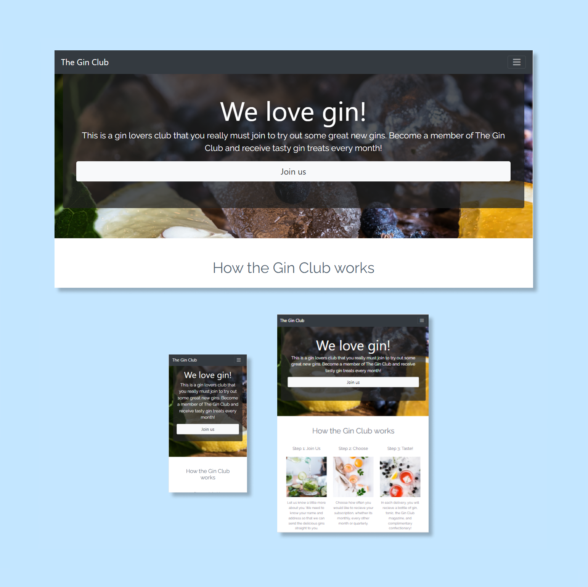

# The Gin Club 

View the live project here. [The Gin Club](https://sophnagle.github.io/Gin/)

I have created a static website for a fictional business that offers a gin and tonic delivery and subscription service. This website allows people to join ‘The Gin Club’ and users are presented with the information about the subscription and they provide their details and subscribe to the service. 
External user goal: The site’s main users, and derived from the main use case, are typically young professionals or older people who love gin and can have good suggested tasters delivered straight to their door without leaving their own home. 
Site owner/business goal: The company wants to increase sales conversion and gain subscriptions. They want to provide full transparency, so the customers are fully aware of the service and how it works, and they want conversion to be simple and friction free. 
As 70% plus of users browse and buy via their phone, it has been designed mobile first however is responsive. The site is one scrollable page with 5 sections; it includes a sign-up section, explains how the subscriptions work, what’s included in each delivery, sample member reviews and a contact form for queries.

### Landing page and navigation

The landing page is purposefully simple. It has a close-up image of lemons and berries being prepared with a glass of gin. It evokes the classy and up-market connotations of the classic ‘gin and tonic’. It has a large ‘join us’ link with large bold prompt and exclamation of liking gin. There is a drop-down navigation bar that links to the different sections of the website however they can scroll down the page and reach the same section. 

### How the gin club works 

This section sets out the steps the user takes to join/sign up and then begin to receive deliveries. Its purpose is to show how simple it is and breaks it down into three easy steps. These steps include a brief explanation with an image akin to the landing page. 

### What’s included 

This section lists the items that the user would expect to receive in a delivery, it also includes an image of a gin hamper with accompanying tonic and confectionary. This image was taken from the stock site Unsplash [Unsplash](https://www.unsplash.com).

### Member reviews 

Reviews are shown to show the user that others have tried and like this, to help validate the business and its service. I have used a carousel so the user can click through reviews. 

### Contact us
The contact us form is there for new subscribers or current ones who have any questions. When on a large device this moves to the left and has lots of white space to the right on purpose. 

### Sign up link 
This is a second sign up link. It has been added for UX and conversion purposes, as by this point the user has scrolled to the bottom. It allows them to sign up there, or prompts them too, without having to scroll back to the top. 

### Footer 
This has links as per the main navigation so the user can revisit sections and also includes social media links. 

---
## User Experience (UX)
### Strategy Plane

The website is for a fictional company that are offering a delivery service of a bottle of a selected gin and accompanying tonics, a magazine and confectionary. It is to increase sales and subscriber conversion and to provide information, trust and confidence to the user of the brand. As there are lots of other companies that do this, the USP here of this B2C company is to be as contemporary, transparent, friction free and simple as possible. It needs to offer a quick, elegant, and good experience. 
The target demographic is young professionals and older people (30-50 year olds) and earn an average to high salary, they love gin and want tasters delivered to home. This could also be purchased by this demographic as a gift for an older person. Because of this, and as 70%+ of users browse and buy form their phone it should be designed mobile first and therefore for a mobile savvy demographic. The site is likely to be used between one and a few times to find out information and then actually subscribe. Returning customers would be using the contact form for customer service. As its commerce and built for customers it needs to ensure a good experience and feeling when a customer browses which will lead them to subscribe. It has to be catchy and compelling with an appropriate colour palette, large imagery and minimal text. 
There are many alcohol delivery services with digital presences and subscriptions. Here are a few of the key ones I have researched and benchmarked: 
* [Little Gin Box](https://www.littleginbox.com/) 
I think this needs more imagery to engage and entice users. It also scrolls part way and doesn’t have much interest or a clear call to action on the landing page. 
* [Craft Gin Club](https://www.craftginclub.co.uk/)
This site has great UX. It is engaging, has clear call to actions and is both contemporary and stylish. It has a few drawbacks; I think it has a lot going on in the long scroll page, there is no sign up link at the bottom of the page and when you click ‘join’ rather than prompting you to a new form, it takes you back to the about section of the page which is a little confusing. 
* [Think Gin Club](https://www.thinkginclub.com/)
This has a clear call to action sign up link on the landing page and is a scrollable page. Much like Craft Gin Club, this seems to be the convention. However, visually some sections are different sizes and I don’t think the images and illustrations compliment each other and provide the consistent brand message. It has included testimonials to show its reliability however they are visually inconsistent and don’t invite the user to click or engage with them. 
To hit these business goals, the user will need information about how they sign up and what they will receive in their deliveries. They will also need clear sign up links with friction free easy to complete forms. 
To make the company seem trustworthy, I am including testimonials from other customers. There is also a contact form where users can ask questions and/or follow the social media links. There is also an option to subscribe to the e-mail marketing. 
Key tasks/cases for the site are as below: 

|   | Opportunity / Problem / Feature | Importance | Viability |
| :-: | --------------------------------- |:-------------:| :--------:|
| A | Find information about how to sign up and what is included | 5 | 5 |
| B | Sign up for deliveries directly from the site | 5 | 4 |
| C | Create an online presence for the brand | 4 | 3 |
| D | Contact the company for further information | 4 | 5 |
| E | Find out about the brand history, who started the company | 2 | 5 |
| F | Find out which gin was delivered last month | 1 | 1 |
|   |  *Total* | *21* | *23* |

This shows that the priorities are the Sign-Up link and form, clear info about how the subscription works and what is included and ways to contact the company. Both E an F, brand history and previous gin’s although may be suitable for some use cases are not as important and would require more time. They could be added at as a later release. 
### Scope Plane

Based on the Strategy, the key features are a large, easy to use Sign up link and form to fill out their details. It should have clear and simple sections with information as to how it works and what they are getting in their delivery. 
The website needs to clearly show the that the company is trustworthy and reliable. It wants to increase sales conversion but also promote itself and have a digital presence. The images will be stylish and be of gin drinks being prepared in home kitchens rather than bars. 
*Structure Plane 
The website is a single scrollable page with 5 sections. These can be scrolled to instinctively by the user, but also navigated to through a drop-down navigation menu that is fixed to the top of the viewport. This is so it is accessible regardless of where the user may have scrolled to. Links will change style on hover, so that a user knows that he/she can click on it for more content or to move about the page. Links that lead to an external page, such as the social media links, will be opened in a new tab so as not to lose this site. The contact form and sign up modal have placeholders so the user can gauge what information they need to divulge and they receive feedback if they have input invalid information, say an email address, or missed a field for example. 
### Skeleton Plane
 
The sections will each have a similar size, although may vary slightly depending on content. Each with have a different colour to differentiate from each other and to also prompt the user to continue to scroll when seen at the bottom of their screen. 
### Surface Plane 
The colour palette is inspired by the imagery used in the landing page and throughout the site. Dark greys and blues serve as a dark backdrop for light text and colourful images alongside deep oranges that are all taken from the fruits used to add to gin (grapefruit). The idea is that they all compliment each other and are therefore linked subconsciously to the user to gin.
The Google Font ‘Raleway’ was used for it’s contemporary and stylish aesthetic that compliments the feel of the site and the gin service. 
I used Figma to design the layout as can be seen here: 
 
### User stories 
First time visitor goals: 
*I love tasting new gins and am looking for some new ones to try. I want to find out about this subscription to see how it works.
*I enjoy having drinks at home and want to order a gin to my home. I want to sign up for deliveries. 
Returning visitor goals: 
*I want to find out more about the subscription and contact someone from the company. 
*I have decided to sign up and want to join easily and quickly. 
### Design 
From researching other alcohol delivery services as well as SME digital delivery services, I found the main UX conventions were to have a large sign up section at the top of the page with bold imagery or graphic that conveys the business or brand offering. This was typically central to the landing page with information either scrollable or found using navigation to separate pages. The idea being it’s the first thing the user sees, so they can assume the brand’s USP and offering from the outset. As I was taking inspiration from digital SME businesses, I found they often had scrollable pages as like this website they often had one or few use cases, Sign Up and or Contact us. 
The sections then follow in order of what users look for; information about how it works, what’s included reviews and a contact us form. I have included an additional Sign-Up link at the bottom for good UX so the user doesn’t have to scroll back to the top. 
### Colours
I used Google’s Material Design guidelines, Adobe Color Wheel too test colour palettes. 
[Google Material Design](https://material.io/design/color/the-color-system.html#color-usage-and-palettes)
[Adobe Color Wheel](https://color.adobe.com/create/color-wheel)

### Typography 
I have used Google Font’s ‘Raleway’ as it is contemporary and stylish. Its lightweight, thin characters compliment the website aesthetic and work for titles as well as text. 
### Images 
Images have been taken from the stock image website [Unsplash](https://unsplash.com/). All images have alt text. 
### Wireframes 
The initial design was created in Figma, with small iterations as it was built and tested as seen here  
### Features 
The website is simple with all the essential information and sections displayed responsively from mobiles to larger screens. The navigation bar and footer link to the different sections or the user can instinctively scroll as per UX conventions. The site includes two large sign-up forms to entice and prompt users to subscribe. 
### Features to implement 
I think the site would be improved with a payment terminal and success alert popups when a user has joined. This would require JavaScript. 
The scrollable nature could be improved with arrows or speeds slowing transitioning when between sections, again this can be developed with JavaScript. 
The contact form is currently static, with the information not going to the server. This feature could be added to make this fully functional. 
To be consistent with its competitors it could have a video as the landing page behind the sign-up form to make it more interactive and engaging, again this requires JavaScript. 
An additional feature to add is a custom page 404.

--- 
## Technologies 
### Languages 
*HTML5
*CSS3
### Frameworks, libraries, and software used
* Bootstrap 4.5.0
* Font Awesome 4.7.0
* Git
* GitHub
* GitPod
* Chrome DevTools
* Google Fonts
* Google Material Design
* Figma

---
## Testing
### Functionality 
All navigation and social links have been checked and they are all working. 
The contact us form and sign up modal have been tested by myself and several others. The validation feedback works and although the information doesn’t go to the server the links/buttons open and close as required. 
The scroll functions smoothly and the site has been tested for responsivity. 
The HTML and CSS have been validated with [HTML Validator](https://validator.w3.org/)  and [CSS Validator](https://jigsaw.w3.org/css-validator/).
HTML: Initially the HTML validator noted errors in the forms as the same IDs had been used (name, email etc..) for both the sign-up modal and the contact us form. It has since been rectified. 
CSS: typographic errors found and rectified. 
### User Testing 
To test the site, I tried it myself on multiple devices and asked friends and family to test it too. 
The feedback I gained was that it was easy to find information, potentially sign up and use the navigation. The text is legible against its backdrops and the images were well received. 
The review carousel was less easy to read on mobile but still legible. 
From further research as I was doing this project, I found that screen-readers can get confused if you don’t use all headings. I have used H1 then H3 for example, missing H2 so this could be better thought out. 
There were several responsive issues, particularly with very large screens as I have designed mobile first. Using media queries and Bootstraps CSS grid classes I improved this. It does however require further improvements or elements added when the site is on very large screens. There is a lot of space that could be better used with more imagery etc. 
Additionally, when submitting the contact form it opened into a new tab as I had included a post method, however this has been removed since deployment as this is just a static site currently. If the site was to be made live for a business this can be added with further back-end code as required
### Compatibility testing
I tested the website on multiple browsers:
* Chrome
* Firefox
* Internet Explorer
* Safari
It was also tested on multiple devices from mobiles to large screen monitors. 
### Performance testing 
I used Google’s Page speed [Google page speed](https://developers.google.com/speed/pagespeed/insights) to test the site speed for desktop and mobile, and used Google’s mobile friendly tester [Mobile tester](https://search.google.com/test/mobile-friendly)to determine it’s mobile performance level.

|  |  |

Both are good, although with small changes could still be improved. Desktop is slightly better than mobile and the these changes could be actioned in future updates. 
The site was confirmed to be mobile friendly. 

Google Lighthouse – 
|  |  | 

It showed that the performance needs improving through resizing the images and that CSS and JS (Bootstrap) is slightly slowing it down. I have added `rel="noopener"’ in links that open in new tabs (social) for security purposes after deployment as suggested. 
For both desktop and mobile it suggests improvement through higher contrast, actual decremental use of H heading tags with no missing steps, image file types and sizes to be changed for quicker. These should be acted upon when updated in the future. 

--- 
## Deployment 
### GitHub
This has been deployed with the following method: 
* Log into GitHub
* Click on the repository that is to be deployed
* Click “Settings”
* Scroll down to ‘GitHub’ pages
* On “source” click “none” and select ‘master branch’ from the dropdown menu
* The page will automatically load
* Scroll again to the ‘GitHub Pages’
* You should see a link “Your site is published at…”
### Forking
Similar to above, if you would like to fork the code, follow this method:
* Log into GitHub and find the repository you are looking for
* Select "Fork" in the top right
* This should then fork the code
### Local clone
Follow the below for a local clone: 
* Log into GitHub and find the repository you want
* Click the green “Code” button (to the right of the screen)
* Dropdown and click the clone the code with HTTPS link (copy this)
* Open Git bash
* Open the directory where you want to work on the cloned code
* Type git clone followed by the link you copied
## Inspiration and credits 
There are lots of gin and other alcohol delivery subscription sites. UX conventions and successes were used as the base design here. 
Bootstrap provided a lot of responsive grid elements in the design. 
As per the Imagery section of this file, the images have come from unsplash.com. 
